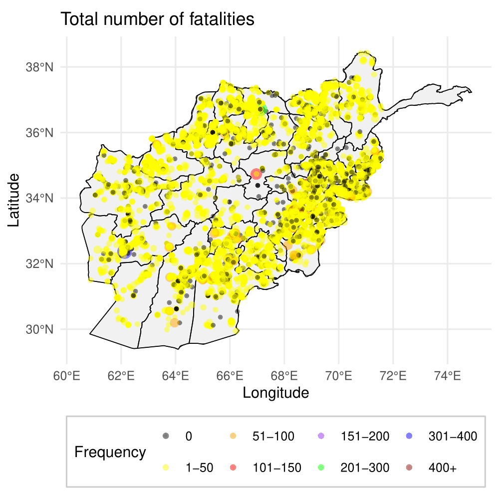
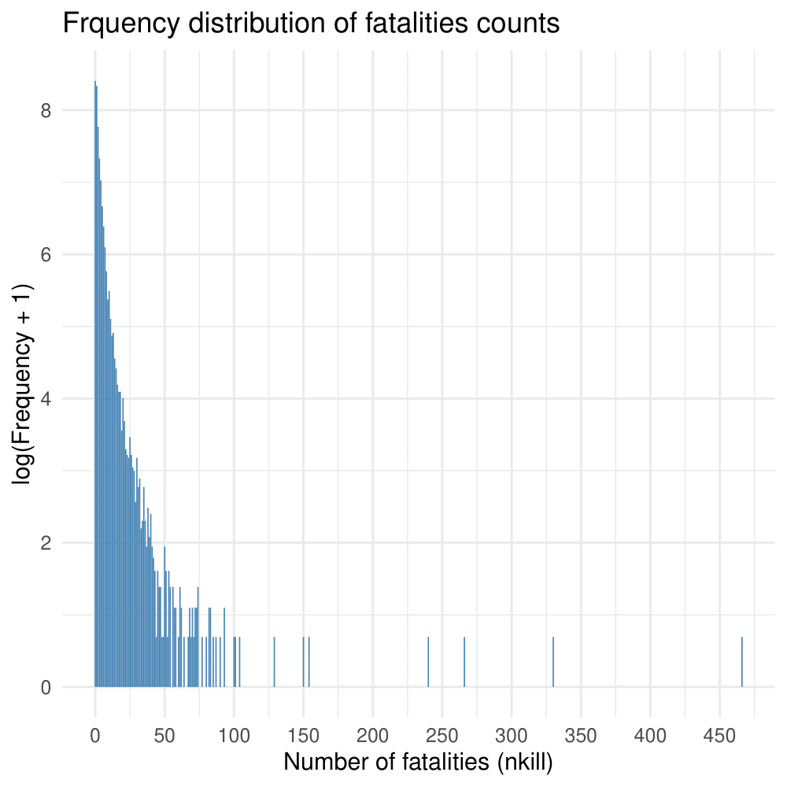

# FlexibleCountModel
This repository provides the implementation of a flexible statistical model designed to handle count data with varying levels of zero inflation and outliers.

To fit the Discrete Extended Generalized Pareto Distribution (DEGPD) and Zero-Inflated Discrete Extended Generalized Pareto Distribution (ZIDEGPD) models, as used in this study, you need to download the code from the "degpd-and-zidegpd" repository using this link:
https://github.com/touqeerahmadunipd/degpd-and-zidegpd

# Real data
This study uses a real dataset from the Global Terrorism Database (GTD). Due to licensing restrictions, the data cannot be shared publicly. For more information or to access the GTD, please visit: https://www.start.umd.edu/using-gtd

  
  

